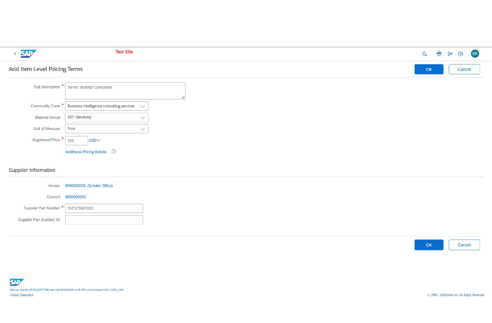
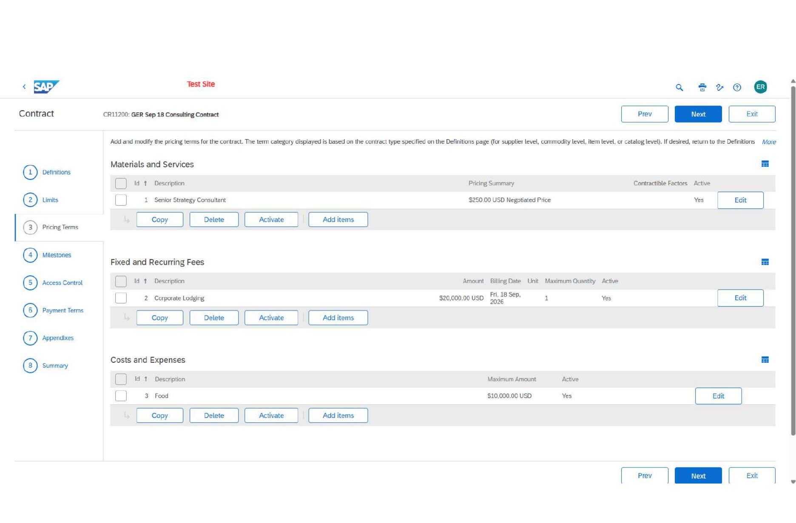
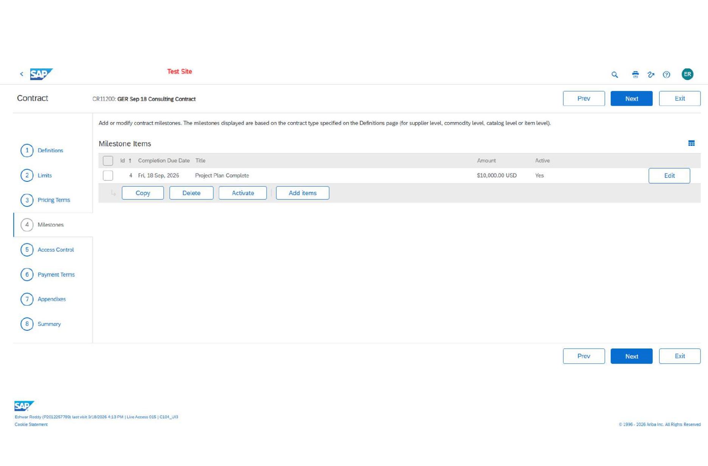
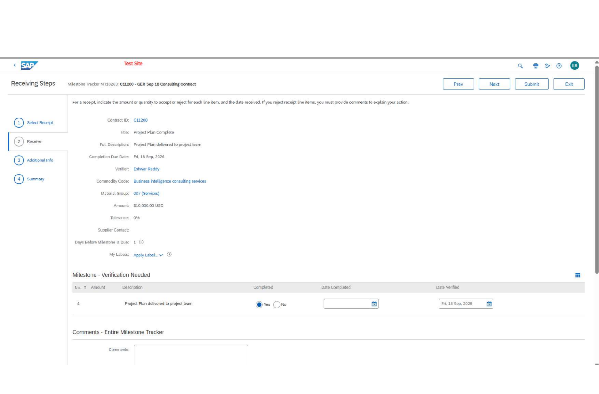
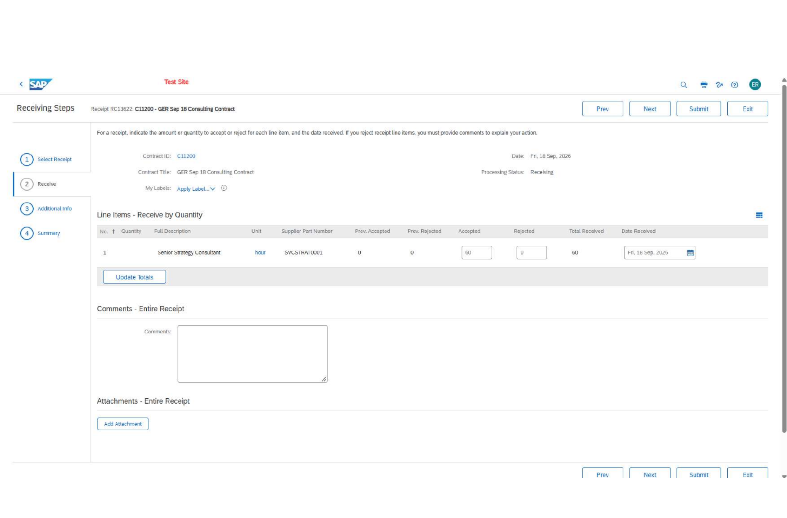

# SAP Ariba Contract Compliance & P2P Controls

**Hands-on SAP Ariba implementation case study | Completed Sep 2026**

I built and tested a contract-compliance flow covering supplier, commodity, item and service contracts. The project connects contract configuration to real transaction behavior: negotiated pricing, tiered discounts, requisition/PO creation, Auto-Catalog pricing, service receiving, milestone verification and contract amendment.

## Results at a glance

| What I delivered | Measured result |
|---|---:|
| Contract models configured | **4** |
| Supplier flat discount | **2%** |
| Commodity discount tiers | **3% / 4% / 5%** |
| Item quantity price tiers | **USD 47.50 / USD 45.00** |
| Submitted contract requisition | **USD 6,750** |
| Purchase order generated | **1** |
| Service contract ceiling | **USD 500,000** |
| Consultant rate | **USD 250/hour** |
| Consultant quantity limit | **1,000 hours** |
| Service received | **60 hours** |
| Receipt value at contract rate | **USD 15,000** |
| Lodging control | **USD 20,000 + 10% tolerance** |
| Food spend control | **USD 10,000 + 10% tolerance** |
| Contract milestone | **USD 10,000, 0% tolerance** |
| Minimum commitment added by amendment | **USD 10,000** |
| Auto-Catalog negotiated price | **USD 15.00 each** |
| Auto-Catalog checkout price | **USD 14.70 each** |

## Business scenario

The requirement was to control purchases from one supplier at several contract levels while proving that the correct commercial terms flow into downstream purchasing and receiving.

I implemented:

1. a **Supplier-Level Master Agreement** for the supplier-wide discount;
2. a **Commodity-Level Subagreement** for spend-based category discounts;
3. an **Item-Level Subagreement** for quantity-based item pricing and an Auto-Catalog item;
4. a **Standalone Service Contract** for consulting services, expenses, milestones and receiving;
5. a **contract amendment** adding a minimum commitment after closure.

## 1. Supplier-Level Master Agreement

Configured the supplier master agreement with:

- **2% flat supplier discount**
- **USD 500,000** overall maximum
- **3%** tolerance
- Release required: **Yes**
- Discount terms applied to non-catalog items: **Yes**
- Subagreement accumulators: **Yes**
- Release access restricted to the authorized user

After the item-level purchasing transaction, the master agreement reflected:

- **USD 6,750 amount spent**
- **USD 493,250 amount available**
- **98.65% remaining**

This proved that downstream spend was accumulating against the parent agreement.

## 2. Commodity-Level Subagreement

Built a subagreement for the **Desk Drawer Organizers** commodity.

### Spend-based tiers

| Minimum accumulated amount | Discount |
|---:|---:|
| USD 0 | **3%** |
| USD 1,000 | **4%** |
| USD 5,000 | **5%** |

Controls used:

- Hierarchy: **Subagreement**
- Parent: supplier master agreement
- Pricing type: **Amount Based Volume Discount**
- Parent pricing compounding: **No**
- Add accumulators to parent: **Yes**

The design keeps the category discount independent while still rolling spend into the supplier master agreement.

## 3. Item-Level Subagreement

Configured **Franklin Electronic Wordmaster Deluxe** with quantity controls and per-order volume pricing.

### Item controls

- Maximum quantity: **4,000**
- Tolerance: **2%**
- Pricing method: **Quantity Based Volume Pricing**
- Scope: **Per Order**
- Quantity **51+**: **USD 47.50**
- Quantity **101+**: **USD 45.00**
- Add accumulators to parent: **Yes**

### Transaction test

| Quantity tested | Unit price observed | Contract behavior |
|---:|---:|---|
| 1 | **USD 48.95** | Parent 2% supplier discount applied |
| 51 | **USD 47.50** | First item-level quantity tier applied |
| 150 | **USD 45.00** | Higher item-level tier applied |

The 150-unit requisition totaled **USD 6,750**, was submitted, approved and generated a contract-based purchase order.

## 4. Auto-Catalog Item Validation

Added a non-catalog contract item:

- Item: **Swingline Stapler (Red)**
- Supplier part number: **SWINGRED**
- UOM: **each**
- Negotiated price: **USD 15.00**
- Contract subscription creation: **enabled**

After activation, the item appeared in catalog search.

### Pricing result

- Catalog price: **USD 15.00**
- Checkout price: **USD 14.70**
- Difference: **USD 0.30**
- Effective discount: **2%**

The checkout selected the supplier-level contract, confirming that the generated catalog item was active and the parent supplier discount was still being evaluated.

The test requisition was deleted instead of being submitted.

## 5. Standalone Service Contract

Built a no-release consulting contract so services could be received directly against the contract.

### Header and financial controls

- Contract type: **Item Level**
- Hierarchy: **Standalone Agreement**
- Maximum limit: **USD 500,000**
- Overall tolerance: **3%**
- Release required: **No**
- Invoicing against contract: **Yes**
- Receiving against contract: **Yes**


### Consultant service line

- Service: **Senior Strategy Consultant**
- Rate: **USD 250/hour**
- Maximum quantity: **1,000 hours**
- Quantity tolerance: **10%**
- Receiving required: **Yes**
- Supplier part number: **SVCSTRAT0001**



### Additional commercial controls

- Corporate Lodging: **USD 20,000**, **10% tolerance**, non-recurring
- Food: **USD 10,000 maximum**, **10% tolerance**



## 6. Milestone Control

Configured the **Project Plan Complete** milestone:

- Amount: **USD 10,000**
- Tolerance: **0%**
- Final valid due date: **20 Sep 2026**
- Completion date entered: **19 Sep 2026**
- Verification date entered: **19 Sep 2026**

The milestone was marked completed and submitted through the verification workflow.





## 7. Service Receiving

Received **60 hours** of consulting service against the standalone contract.

At the negotiated rate:

**60 hours x USD 250/hour = USD 15,000**

The receipt was submitted and the system returned **Receiving - Done**, proving the contract-to-receipt flow.




## 8. Contract Lifecycle Management

I then tested contract lifecycle control on the supplier master agreement:

1. manually closed the supplier-level contract;
2. opened the associated Contract Request;
3. created a change version;
4. changed **Minimum Commitment to USD 10,000**;
5. submitted the amendment;
6. verified the created version and final status.

The amended version remained **Closed** because SAP Ariba automatically inherited the state of the manually closed previous version. I verified this system behavior rather than reopening or overriding it.

## End-to-end flow

```text
Supplier Master Agreement
  ├─ 2% supplier discount
  ├─ USD 500K limit / 3% tolerance
  │
  ├─ Commodity Subagreement
  │   └─ 3% / 4% / 5% spend tiers
  │
  └─ Item Subagreement
      ├─ Quantity pricing: USD 47.50 / USD 45.00
      ├─ Requisition: USD 6,750
      ├─ Purchase Order generated
      └─ Auto-Catalog item: USD 15.00 -> USD 14.70

Standalone Service Contract
  ├─ USD 250/hour consultant
  ├─ 1,000-hour ceiling
  ├─ USD 20K lodging control
  ├─ USD 10K food control
  ├─ USD 10K milestone
  └─ 60 hours received = USD 15K at contract rate

Lifecycle Management
  └─ Close -> Change -> USD 10K Minimum Commitment -> New Version
```

## What this project demonstrates

- Building contract hierarchy rather than configuring a single isolated contract
- Translating commercial terms into executable SAP Ariba pricing controls
- Testing contract selection at different quantities
- Validating parent-versus-child pricing behavior
- Connecting requisition execution to parent contract spend
- Generating a purchase order from a contract-backed requisition
- Turning a non-catalog contract item into a searchable Auto-Catalog item
- Processing service receiving against a no-release contract
- Verifying a financial milestone
- Managing contract closure and amendment/versioning

## Skills demonstrated

**SAP Ariba:** Contract Compliance, Buying, Requisitions, Purchase Orders, Receiving, Auto-Catalog, Contract Amendments

**Contract configuration:** Supplier Level, Commodity Level, Item Level, Master Agreements, Subagreements, Standalone Agreements, Limits, Tolerances, Access Controls, Accumulators

**Commercial controls:** Flat Discounts, Amount-Based Volume Discounts, Quantity-Based Volume Pricing, Service Rates, Expense Limits, Milestones, Minimum Commitments

**P2P execution:** Contract Selection, Requisition Validation, PO Generation, Service Receipt, Contract Spend Tracking

## Repository structure

```text
SAP-Ariba-Contract-Compliance-P2P-Project/
├── README.md
├── PROJECT_NOTES.md
├── SAP_LEARNING_CREDENTIALS.md
└── assets/
    ├── 01_service_item_pricing.png
    ├── 02_contract_limits.png
    ├── 03_milestone_configuration.png
    ├── 04_milestone_verification.png
    ├── 05_contract_summary.png
    ├── 06_pricing_terms_summary.png
    ├── 07_receipt_60_hours.png
    └── 08_receiving_done.png
```

## Evidence and scope

The screenshots are from my execution in an **SAP Ariba Live Access / test environment**. This repository is a hands-on implementation case study, not a production-client claim.

The evidence covers contract configuration, pricing tests, requisition/PO behavior, Auto-Catalog validation, milestone verification, service receiving, contract closure and amendment. A completed production invoice or invoice reconciliation is **not** claimed here.

The SAP course/exercise material itself is not reproduced or uploaded.

---

**Project completed by Eshwar Reddy | Sep 2026**

SAP and SAP Ariba are trademarks of SAP SE or its affiliates.
