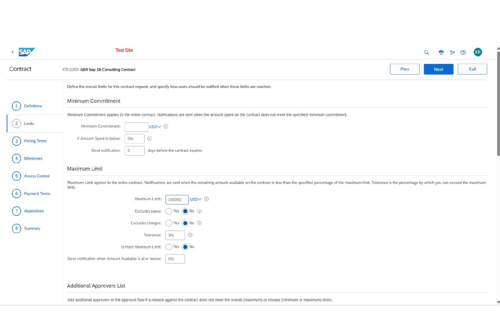

# SAP Ariba Contract Compliance & Contract-Based Receiving

Hands-on **SAP Ariba Procurement / Procure-to-Pay (P2P)** portfolio project completed in an SAP Ariba learning / Live Access environment. The project demonstrates contract configuration, pricing controls, milestone verification, service receiving, and readiness for downstream invoice processing.

> **Portfolio note:** This is a training project, not a production client implementation. Screenshots use training-system data and are included only to demonstrate hands-on process knowledge.

## Project Snapshot

| Area | Configuration / Outcome |
|---|---|
| Platform | SAP Ariba Procurement |
| Focus | Contract Compliance, Buying & Invoicing, Receiving |
| Contract Type | Item-level, standalone agreement |
| Overall Maximum | **USD 500,000** |
| Overall Tolerance | **3%** |
| Invoicing | Allowed |
| Receiving | Allowed |
| Release Requirement | **No release required** |
| Service Rate | **USD 250/hour** |
| Service Quantity Ceiling | **1,000 hours** |
| Milestone | **USD 10,000**, verified |
| Service Receipt | **60 hours**, approved |
| Final Receiving Status | **Done** |

## Business Scenario

A consulting-services contract was configured with negotiated service pricing, expense controls, milestone verification, and receiving requirements. The objective was to connect contract setup with downstream P2P execution and prepare the transaction flow for a contract-based invoice exercise.

## Process Flow

```text
Contract Request
      ↓
Contract Definition & Controls
      ↓
Pricing Terms & Tolerances
      ↓
Milestone Setup
      ↓
Contract Processing
      ↓
Milestone Verification
      ↓
Contract-Based Service Receipt
      ↓
Receipt Approval
      ↓
Receiving Complete
      ↓
Ready for Downstream Invoice Processing
```

## Hands-on Configuration

### 1. Service Item Pricing

Configured **Senior Strategy Consultant** as a service item with:

- Negotiated rate: **USD 250/hour**
- Maximum quantity: **1,000 hours**
- Tolerance: **10%**
- Supplier part number: **SVCSTRAT0001**
- Receiving required: **Yes**


### 2. Contract Limits & Controls

Configured contract-level controls including:

- Overall maximum limit: **USD 500,000**
- Overall tolerance: **3%**
- Invoicing allowed: **Yes**
- Receiving allowed: **Yes**
- Release required: **No**



### 3. Additional Pricing Terms

Configured additional commercial terms:

- **Corporate Lodging:** USD 20,000, 10% tolerance, non-recurring
- **Food:** maximum amount USD 10,000, 10% tolerance


### 4. Milestone Configuration & Verification

Configured the **Project Plan Complete** milestone:

- Amount: **USD 10,000**
- Due date: **18 Sep 2026**
- Tolerance: **0%**
- Outcome: successfully verified / submitted


### 5. Contract Summary Validation

Reviewed the contract summary and confirmed the key definition, dates, hierarchy, purchasing controls, and commercial settings before downstream processing.


### 6. Contract-Based Receiving

Created a receipt against the contract for **60 hours** of Senior Strategy Consultant services.

- Quantity received: **60 hours**
- Receipt status: **Approved**
- Final status: **Receiving - Done**


## Validation Performed

- Checked contract dates, hierarchy, currency, and control settings
- Validated overall maximum amount and tolerance
- Confirmed consultant rate, unit of measure, quantity ceiling, supplier part number, and receiving requirement
- Reviewed lodging and food pricing controls
- Verified milestone amount, due date, tolerance, and completion
- Confirmed 60-hour service receipt against the contract
- Verified receipt approval and completed receiving status
- Confirmed readiness for the next contract-based invoicing exercise

## Skills Demonstrated

- SAP Ariba Contract Compliance
- SAP Ariba Buying & Invoicing
- Procure-to-Pay (P2P)
- Contract request and contract setup
- Item-level pricing terms
- Service procurement
- Contract limits and tolerances
- Milestone configuration and verification
- Contract-based receiving
- Receipt processing and status validation
- Procurement documentation
- Supplier / service coordination
- Workflow troubleshooting and validation

## SAP Learning Credentials

This hands-on project is supported by SAP Learning coursework in Contract Compliance, Buying & Invoicing, Receiving, Invoice Reconciliation, Procurement Reporting, Guided Buying, Approval Rules, Implementation, and Integration.

See **[SAP Learning Credentials](SAP_LEARNING_CREDENTIALS.md)** for the course list and verification links.

## Resume Relevance

This project demonstrates practical knowledge relevant to roles involving:

- SAP Ariba Contract Compliance
- Procurement Operations
- Buying & Invoicing
- P2P controls
- Purchase order / receipt / invoice workflows
- Contract monitoring
- Procurement compliance
- Reporting and audit-ready documentation

## Repository Structure

```text
SAP-Ariba-Contract-Compliance-P2P-Project/
├── README.md
├── SAP_LEARNING_CREDENTIALS.md
├── PROJECT_NOTES.md
└── assets/
    ├── 01_service_item_pricing.png
    ├── 02_contract_limits.png
    ├── 03_milestone_configuration.png
    ├── 04_milestone_verification.png
    ├── 05_contract_summary.png
    ├── 06_pricing_terms_summary.png
    ├── 07_receipt_60_hours.png
    └── 08_receiving_done.png
```

## Disclaimer

SAP and SAP Ariba are trademarks of SAP SE or its affiliates. This repository is an independent learning portfolio and is not affiliated with, endorsed by, or representative of a production implementation for SAP, an employer, or a client.
